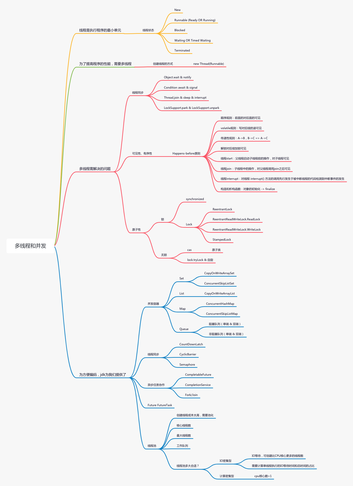

# 第一题：思考有多少种方式，在 main 函数启动一个新线程，运行一个方法，拿到这个方法的返回值后，退出主线程?

源码见ThreadValueGetter.java

如果需要在主线程里拿到子线程的返回值，主要问题是判断子线程执行完了没有

* 等待足够的时间：Thread.sleep、死循环判断是否有结果
* 等待，子线程执行完之后通知
    * 基础：subThread.join、LockSupport.park & unpark、Object.wait & notify、Condition.await & signal
    * 工具（本质都是基于上述基础）: FutureTask、CountDownLatch、CyclicBarrier、Semaphore、Exchanger、阻塞队列
* 其他非常规方法：让子线程先拿到锁，当主线程拿到锁之后，说明子线程已经执行完了

# 第二题：把多线程和并发相关知识梳理一遍，画一个脑图

